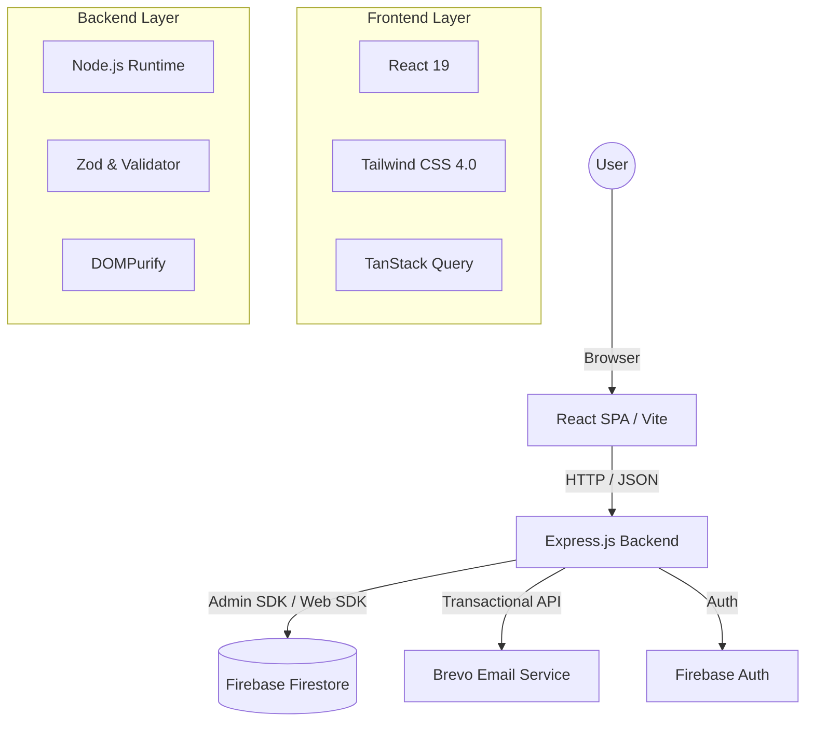

# Documentation: Yoga Kirana Studio Platform

## 1. Project Overview
**Yoga Kirana Studio** is a premium, full-stack web application designed for a modern yoga and wellness studio. It provides a platform for users to browse yoga programs (General & Therapy), register for sessions, and communicate with the studio. It includes a robust lead management system with double opt-in verification and an administrative dashboard.

---

## 2. Architecture Overview



### Architectural Principles:
- **Client-Side SPA**: Using `wouter` for lightweight routing and `TanStack Query` for state management and caching.
- **Server-Side API**: All sensitive operations (emailing, administrative tasks, complex validation) are handled by the Express backend.
- **Resilient Database**: Firebase Firestore for real-time, document-oriented storage.
- **Security-First**: Implementation of rate limiting, data sanitization, and double opt-in verification.

---

## 3. Tech Stack

### Frontend
- **Framework**: React 19 (Vite)
- **Styling**: Tailwind CSS 4.0 (Modern utility-first framework)
- **Components**: shadcn/ui + Framer Motion (Animations)
- **Icons**: Lucide React
- **Routing**: wouter
- **Data Fetching**: @tanstack/react-query
- **Smooth Scrolling**: Lenis

### Backend
- **Server**: Express.js (Node.js)
- **Language**: TypeScript (using `tsx` for execution)
- **Security**: express-rate-limit, dompurify, validator
- **Validation**: Zod (Schema-based validation)

### Cloud & Third-Party
- **Database**: Firebase Firestore
- **Authentication**: Firebase Admin SDK
- **Email**: Brevo (formerly Sendinblue)
- **SMS (Optional)**: Twilio

---

## 4. Key Features & Business Logic

### A. Program Management
- Categorization of yoga into **General** and **Therapy**.
- Multi-tier pricing (Basic, Standard, Premium) for each program.
- Dynamic program details fetched from a central data model.

### B. Lead Management (Double Opt-in)
- **Submission**: Users submit an enquiry via the Contact Form.
- **Verification**: The system sends a secure link via Brevo.
- **Confirmation**: Only after the user verifies their email, the admin is notified and the lead is marked as `verified` in the database.
- **Security**: Prevents spam leads and ensures valid contact information.

### C. Registration Workflow
- Comprehensive registration form collecting health data (medical history, age, etc.).
- Real-time Firestore storage for session tracking.

### D. Administrative Dashboard
- Secure access to all verified messages and enquiries.
- Ability to delete or manage leads directly from the UI.

---

## 5. Database Schema (Firestore)

### `messages` Collection
| Field | Type | Description |
|---|---|---|
| `name` | string | User's name |
| `email` | string | Verified/Unverified email |
| `phone` | string | Contact number |
| `message` | string | Sanitized query |
| `verified` | boolean | Double opt-in status |
| `verificationToken`| string | Secure hex token |
| `expiresAt` | timestamp | Token expiry (24h) |
| `date` | timestamp | Submission time |

### `registrations` Collection
| Field | Type | Description |
|---|---|---|
| `fullName` | string | Registrant name |
| `email` | string | Primary contact |
| `programId` | string | Reference to program |
| `medicalHistory`| string | Health disclosure |
| `createdAt` | timestamp | Enrollment time |

---

## 6. Project Structure

```bash
├── server.ts             # Express Backend Entry
├── vite.config.ts        # Frontend Build Config
├── src/
│   ├── App.tsx           # Routing & Layout
│   ├── main.tsx          # Client Entry
│   ├── pages/            # Page Components (Home, Admin, etc.)
│   ├── components/       # Reusable UI (Navbar, Footer, Shadcn)
│   ├── data/             # Static Data Models (programs.ts)
│   └── lib/              # Utils (cn, firebase config)
├── firestore.rules       # Security Rules for Database
└── firebase-blueprint.json # DB Schema Definition
```

---

## 7. Configuration Requirement
To run this project fully, the following environment variables are required:
- `BREVO_API_KEY`: For email delivery.
- `ADMIN_EMAIL`: Receiver for lead notifications.
- `FIREBASE_CONFIG`: Project credentials.

---

## 8. Deployment & Build
- **Build Command**: `npm run build` (generates static files for deployment).
- **Start Command**: `npm run dev` (starts both Vite and Express in unified dev mode).
